# Superpowers Pack

This pack implements the Gas City `build-base` workflow contract with vendored
[Superpowers](https://github.com/obra/superpowers) skills.

The pack-local compatibility ledger lives at
[`superpowers/REQUIREMENTS.md`](./REQUIREMENTS.md) and records the build-base
contract proofs, including the inherited `gc` import, preserved anchor order,
mode and drain declarations, the durable TDD step sequence, and the evidence
commands that reproduce each claim.

## What It Provides

- Formula: `superpowers-build`
- Methodology formulas: `superpowers-planning`, `superpowers-decomposition`,
  `superpowers-implementation`, `superpowers-review`, and
  `superpowers-fix-loop`
- Expansion formulas: `superpowers-brainstorming`, `superpowers-plan-review`,
  `superpowers-task-review`, and `superpowers-code-review`
- Implementation item formulas: `superpowers-development`,
  `superpowers-development-item`
- Vendored skills: `brainstorming`, `writing-plans`, `executing-plans`,
  `subagent-driven-development`, `requesting-code-review`,
  `receiving-code-review`, `finishing-a-development-branch`,
  `test-driven-development`, `verification-before-completion`, and
  `using-git-worktrees`
- Provenance: `vendor/superpowers/upstream.toml`

## Build-Base Mapping

`superpowers-build` extends `build-base` and keeps the inherited anchor order
`prepare -> requirements -> plan -> plan-review -> decompose ->
implement/implement-same-session -> review -> finalize -> publish`. The pack
overrides `requirements` (brainstorm + written-spec loops), `plan`
(writing-plans), `plan-review` (plan review loop), `decompose` (scope-only
task beads + convoy), `implement`/`implement-same-session` (TDD development
drains), `review` (code review + gap analysis fanout), and `finalize`
(finishing-a-development-branch); `prepare` and `publish` stay inherited. No
anchor is renamed, skipped, or reordered, and no top-level stage is added.

The native stage formulas extend the matching base methodology contracts:
`superpowers-planning` (`planning-base`), `superpowers-decomposition`
(`decomposition-base`), `superpowers-implementation` (`implement`),
`superpowers-review` (`code-review-base`), and `superpowers-fix-loop`
(`fix-loop-base`). `superpowers-build` pins them as its selector defaults
(`planning_formula`, `decomposition_formula`, `implementation_formula`,
`implementation_item_formula`, `code_review_formula`, `review_fix_formula`)
with `implementation_target` defaulting to `superpowers.implementer`.

Supported modes and drain policies, as declared in
`[metadata.gc.methodology]`:

- `interaction_modes`: `interactive`, `autonomous`, `headless` (inherited
  `interaction_mode` var, default `interactive`)
- `review_modes`: `report`, `agent`, `interactive` (inherited `review_mode`
  var, default `agent`)
- `implementation_strategy`: `drain` with `allowed_drain_policies` of
  `separate` (drains `superpowers-development` with exclusive member access)
  and `same-session` (drains `superpowers-development-item` in one shared
  single-lane session with `on_item_failure = "skip_remaining"`)

The review/fix loop is graph structure: the `review` anchor expands
`superpowers-code-review`, which fans out sibling `request-code-review` and
`gap-analysis-review` lanes, fans in at `process-code-review` (routed to the
caller-selected implementation target), and loops through a bounded graph
check until the `code_review.verdict=done` approval lands on the workflow
root. `superpowers-fix-loop` carries the same review-fix contract for
standalone adapter use.

Superpowers includes prompt templates for subagent-driven development. This
pack converts the execution handoff into Gas City convoy members and drained
item formulas. Task beads carry task scope; the item formulas carry the TDD
execution procedure. The vendored prompt files are source material only; the
workflow must not invoke provider-native subagents, slash commands, task tools,
or the upstream plugin runtime.

Superpowers task review is the per-item conversion point for raw
`subagent-driven-development`. The `superpowers-task-review` expansion adds
spec-compliance and code-quality fanout lanes after each task's TDD pass. Those
lanes preserve the expected review order without launching provider-native
subagents: the spec-compliance lane runs first, the implementation lane applies
spec findings, the code-quality lane reviews the corrected task, and the final
apply lane owns the `code_review.verdict=done|iterate` loop.

## End-to-End Flow

The Superpowers pack preserves the stock Superpowers shape, but replaces native
subagent dispatch with Gas City beads, convoys, drains, and graph lanes.

```mermaid
flowchart TD
    classDef inherited fill:#eef2ff,stroke:#4f46e5,color:#111827;
    classDef superpowers fill:#ecfdf5,stroke:#059669,color:#111827;
    classDef infra fill:#fff7ed,stroke:#d97706,color:#111827;
    classDef terminal fill:#f9fafb,stroke:#6b7280,color:#111827;

    Start["Launch superpowers-build"]:::terminal --> Prepare["prepare<br/>inherited build-base"]:::inherited
    Prepare --> ReqSetup

    subgraph Requirements["requirements override: Superpowers brainstorming + written-spec loops"]
        direction TB
        ReqSetup["setup brainstorming context<br/>Superpowers override"]:::superpowers --> BrainstormDesign["brainstorm-design<br/>brainstorming skill"]:::superpowers
        BrainstormDesign --> ConfirmDesign["confirm-design-approval<br/>Superpowers approval pass"]:::superpowers
        ConfirmDesign --> DesignGate{"design approved?<br/>graph check"}:::infra
        DesignGate -->|no: loop with feedback| BrainstormDesign
        DesignGate -->|yes| WriteSpec["write-requirements-spec<br/>Superpowers spec pass"]:::superpowers
        WriteSpec --> SpecReview["review-written-spec<br/>spec reviewer prompt"]:::superpowers
        SpecReview --> ApplySpecFeedback["apply-spec-feedback<br/>brainstorming lane"]:::superpowers
        ApplySpecFeedback --> ConfirmSpec["confirm-spec-approval<br/>Superpowers approval pass"]:::superpowers
        ConfirmSpec --> SpecGate{"spec approved?<br/>graph check"}:::infra
        SpecGate -->|no: next spec iteration| WriteSpec
        SpecGate -->|yes| RequirementsDone["finalize approved requirements<br/>Superpowers override"]:::superpowers
    end

    RequirementsDone --> PlanWrite["plan<br/>writing-plans skill override"]:::superpowers

    subgraph PlanReview["plan-review override: Superpowers plan review loop"]
        direction TB
        PlanWrite --> PlanReviewSetup["prepare plan review context<br/>Superpowers override"]:::superpowers
        PlanReviewSetup --> PlanDocReview["plan-document-review<br/>plan reviewer prompt"]:::superpowers
        PlanDocReview --> ApplyPlanFeedback["apply-plan-feedback<br/>writing-plans lane"]:::superpowers
        ApplyPlanFeedback --> PlanGate{"plan approved?<br/>graph check"}:::infra
        PlanGate -->|no: review revised plan| PlanDocReview
        PlanGate -->|yes| PlanReviewDone["finalize approved plan<br/>Superpowers override"]:::superpowers
    end

    PlanReviewDone --> Decompose["decompose<br/>Superpowers override: scope-only task beads + convoy"]:::superpowers
    Decompose --> DrainChoice{"drain policy<br/>Gas City drain"}:::infra
    DrainChoice -->|separate| DrainSeparate["separate drain<br/>parallel by convoy deps"]:::infra
    DrainChoice -->|same-session| DrainShared["same-session drain<br/>single worker lane"]:::infra

    DrainSeparate --> ItemFanout["fan out runnable implementation beads"]:::infra
    DrainShared --> ItemSerial["serialize convoy members"]:::infra

    subgraph ItemFormula["implementation item formulas: one formula instance per implementation bead"]
        direction TB
        SeparatePrep["prepare-worktree<br/>inherited do-work<br/>separate drain only"]:::inherited --> SeparateInspect["inspect task scope<br/>Superpowers implement override"]:::superpowers
        SharedInspect["inspect shared task scope<br/>Superpowers implement-item override"]:::superpowers
        SeparateInspect --> WriteTest["write failing test"]:::superpowers
        SharedInspect --> WriteTest
        WriteTest --> VerifyRed["verify test fails"]:::superpowers
        VerifyRed --> Code["implement minimal change"]:::superpowers
        Code --> VerifyGreen["verify tests pass"]:::superpowers
        VerifyGreen --> TaskReview["task-review<br/>spec + quality fanout"]:::superpowers
        TaskReview --> Record["record task result"]:::superpowers
        Record --> CloseItem["close source anchor<br/>Superpowers override"]:::superpowers
    end

    ItemFanout --> SeparatePrep
    ItemSerial --> SharedInspect
    CloseItem --> DrainFanIn["fan in<br/>drain waits for all item roots"]:::infra

    DrainFanIn --> ReviewSetup["review<br/>Superpowers code-review override"]:::superpowers

    subgraph ReviewLoop["post-implementation review loop"]
        direction TB
        ReviewSetup --> ReviewFanout["fan out review lanes"]:::infra

        subgraph ReviewLanes["parallel reviewer lanes: sibling beads with no needs between them"]
            direction LR
            CodeReview["request-code-review lane"]:::superpowers
            GapReview["gap-analysis-review lane"]:::superpowers
        end

        ReviewFanout --> CodeReview
        ReviewFanout --> GapReview
        CodeReview --> ReviewFanIn["fan in<br/>wait for both review artifacts"]:::infra
        GapReview --> ReviewFanIn
        ReviewFanIn --> ReviewProcess["process code-review feedback"]:::superpowers
        ReviewProcess --> ReviewDecision{"implementation approved?<br/>graph check"}:::infra
        ReviewDecision -->|no: fix and re-review| ReviewFanout
        ReviewDecision -->|yes| ReviewDone["review approved"]:::superpowers
    end

    ReviewDone --> Finalize["finalize<br/>finishing-a-development-branch override"]:::superpowers
    Finalize --> Publish["publish<br/>inherited build-base"]:::inherited
    Publish --> Done["workflow complete"]:::terminal
```



Blue nodes are inherited base behavior, green nodes are Superpowers-specific
overrides, and amber nodes are Gas City graph, convoy, or drain infrastructure.
The brainstorm and plan phases are explicit approval loops: a failed graph
check creates another iteration of the same loop rather than falling through to
implementation.

The post-implementation review lanes are real fan-out/fan-in graph work. The
reviewer beads are siblings with no dependencies between them; only the
feedback-processing bead waits on both review artifacts.

In the separate-drain path, independent implementation beads can run in parallel
subject to convoy dependencies. Each drained implementation bead gets its own
item formula instance. Each implementation step in that item formula uses a
continuation group derived from that bead's `{{issue}}`, so session affinity
stays inside one convoy member instead of spanning the convoy. In the
same-session path, the drain serializes convoy members while the item formula
still scopes its continuation group per bead. Both paths converge before the
post-implementation review fan-out.

For direct `superpowers-build` usage, keep `interaction_mode` conceptually
interactive when you want the raw Superpowers design/spec approval experience.
Automation adapters can run autonomously, but they still use the same Gas City
fanout lanes and review loops. Use `review_mode=report` for read-only adapter
contexts and `review_mode=interactive` only when the review is allowed to behave
like a top-level raw-framework review.

## Import It

Import this pack at city scope. It imports the Gas City pack internally as
`gc`, so `build-base` is available transitively:

```toml
[imports.superpowers]
source = "../gascity-packs/superpowers"
```

Then launch `superpowers-build` from the target rig context. Rig role agents
still use the Gas City `gc.*` override surface.
